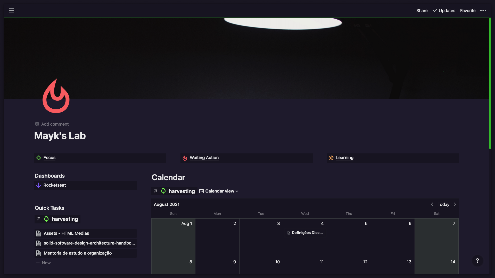

# Notion Omni

Inject some JS/CSS to customize Notion ;)

---

<p align="center">
<a href="#how-to-build">How to build</a>&nbsp;&nbsp;&nbsp;&nbsp;
<a href="#features">Features</a>
&nbsp;&nbsp;&nbsp;&nbsp;
<a href="#contact">Contact</a>
&nbsp;&nbsp;&nbsp;&nbsp;
</p>



---

## How to build

1. Install

```sh
yarn
```

2. Build

```sh
yarn package
```

3. Run your new app.
   _It will be at dir ./out_

4. Put your Notion in Dark Mode ;)

# Features

## Content Only

Because we love a clean layout, we can toggle (show/hide) view of

- header bar
- page title & attributes block
- help button

by pressing `ctrl+esc`


---

## Slide Presentation

You can use this app as a slide presentation.


### 🤔 How?

1. Prepare your presentation

   - Each divider will be a new slide block

2. Toggle presentation with `SHIFT+ESC`

Try this.

Create a new Notion page and add code bellow, then hit `SHIFT+ESC` to see the magic.

```md
---
# Slide one

Some content
---

## Slide two

Second slide

---
## With h2 header

Try it!
```

# Contact

Mayk Brito

- [maykbrito.dev](https://maykbrito.dev)

---

If this project helps you, please leave your star 🌟 Thank you 💛
